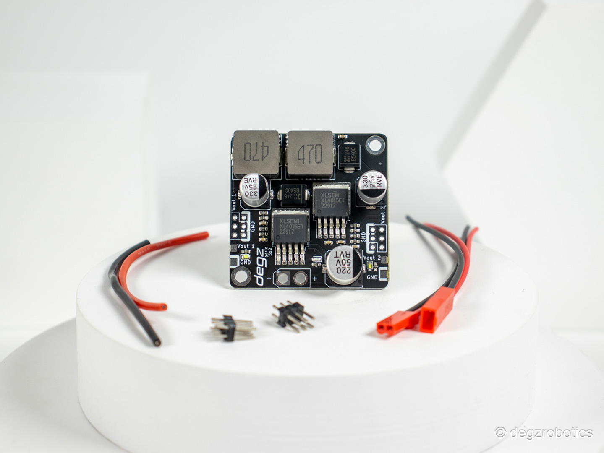

# DEGZ 5V / 12V Gerilim Regülatörü

> 6S batarya voltajını (22.2 V) elektronik sistemin kullanabileceği 5 V ve 12 V'a düşürür. İki bağımsız çıkış hattı vardır.



| | |
|-|-|
| Üretici | DEGZ Robotics |
| Satıcı | mucif.com |
| Birim Fiyat | 1.404 TL |
| Proje Adedi | 1 |
| Durum | Alındı |

---

## Teknik Özellikler

| Parametre | Değer |
|-----------|-------|
| Giriş voltajı | 8–36 V (3S–8S LiPo uyumlu) |
| Çıkış 1 | 5 V / 5 A |
| Çıkış 2 | 12 V / 4 A |
| Konfigürasyon seçenekleri | 2× 5 V, 2× 12 V veya 1× 5 V + 1× 12 V |
| Tip | DC-DC Buck (step-down) |
| Ters bağlantı koruması | **Yok** |

---

## Güç Zinciri

```
Batarya (22.2 V)
    └── PDB
          └── DEGZ 5V/12V Regülatör
                    ├── 5 V çıkış → RC alıcı, servo
                    │              → Pololu 3.3 V Reg → ESP32-S3
                    └── 12 V çıkış → Kamera, aydınlatma (planlanan)
```

---

## Yük Tahmini

| Hat | Yük | Akım Tahmini |
|-----|-----|--------------|
| 5 V | RC alıcı + Pololu reg | ~400 mA |
| 3.3 V (Pololu üzerinden) | ESP32 + sensörler | ~700 mA |
| 12 V | Kamera, aydınlatma | TBD |

---

## Uyarılar

- **Ters bağlantı koruması yok** — bağlantı öncesi polariteyi mutlaka kontrol et
- 5 V / 5 A ve 12 V / 4 A limitlerini aşma
- Uzun çalışmada ısınma takibi yap, gerekirse soğutucu ekle
- ESP32'yi doğrudan 5 V hattına bağlama — Pololu 3.3 V regülatör üzerinden besle
