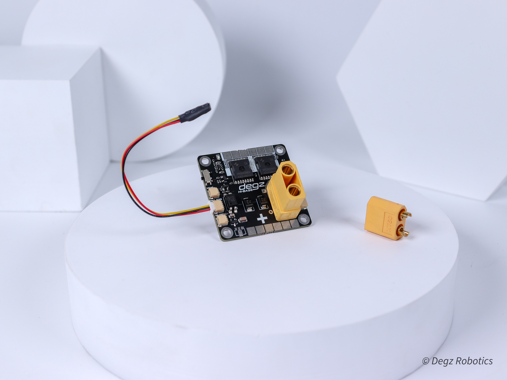

# DEGZ Güç Dağıtım Kartı — Hi-Base

> Batarya ile ESC/elektronik arasındaki merkez güç dağıtım noktası. Hall effect sensör ile akım ve voltaj ölçümü ESP32'ye iletilir.



| | |
|-|-|
| Üretici | DEGZ Robotics |
| Satıcı | mucif.com |
| Birim Fiyat | 4.694 TL |
| Proje Adedi | 1 |
| Durum | Alındı |

---

## Teknik Özellikler

| Parametre | Değer |
|-----------|-------|
| Max akım (ana hat) | 200 A |
| Boyut | 45 × 45 mm |
| Voltaj sensörü | JST çıkış, gerçek zamanlı |
| Akım sensörü | Hall Effect, JST çıkış |
| Sıcaklık sensörü | Termistör, JST çıkış |
| On/Off kontrolü | JST çıkış |
| Bağlantı kapasitesi | Sınırsız (200 A dahilinde) |

---

## JST Çıkışları

| Port | Sinyal | ESP32 Bağlantısı |
|------|--------|-----------------|
| Voltaj | Batarya gerilimi (anlık) | ADC (TBD) |
| Hall Effect | Akım yönü + şiddeti | ADC veya UART (TBD) |
| Termistör | Sıcaklık | ADC (TBD) |
| On/Off | Kart açma/kapama | GPIO (opsiyonel) |

---

## Güç Zinciri

```
Batarya (6S, 22.2 V)
    └── XT90 → PDB Hi-Base (200 A)
                  ├── ESC Sol (60 A max)
                  │     └── Motor Sol
                  ├── ESC Sağ (60 A max)
                  │     └── Motor Sağ
                  └── DEGZ 5V/12V Regülatör
                              └── Elektronik
```

---

## Projede Kullanım

- 2× ESC 60 A = max 120 A — 200 A limitin çok altında, güvenli marj var
- Hall Effect verisi ESP32'ye aktarılarak anlık akım takibi ve batarya yük hesabı yapılabilir
- On/Off JST pini → acil durdurma (kill switch) veya ESP32 GPIO ile yazılımsal kontrol
- 45 × 45 mm kompakt form — gövde içi yerleşim için uygun

---

## Uyarılar

- Ana hat kablosu **10 AWG** veya daha kalın kullan
- Su geçirmez muhafaza içine al (IP67+)
- JST kablo renk kodlarını ve pin sıralarını montaj öncesi doğrula
