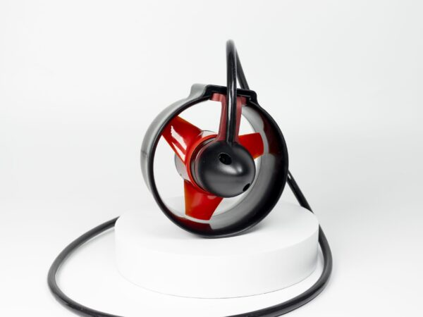

# DEGZ Ultras Su Altı İticisi

> Her iki tekne gövdesine birer adet monte edilir. Diferansiyel hız kontrolü ile dönüş sağlanır; dümen gerekmez.



| | |
|-|-|
| Üretici | DEGZ Robotics |
| Satıcı | mucif.com |
| Birim Fiyat | 15.968 TL (KDV dahil) |
| Proje Adedi | 2 |
| Durum | Alındı |

---

## Teknik Özellikler

| Parametre | Değer |
|-----------|-------|
| İtki gücü | 8 kgf @ 24 V (6S) |
| Voltaj aralığı | 3S–6S (12–24 V) |
| Max sürekli akım | 35 A |
| Max derinlik | 500 m |
| Motor | M5 fırçasız (brushless) |
| Gövde | Poliüretan (enjeksiyon kalıplama) |
| Tutucu | Uçak sınıfı alüminyum |
| Montaj | M5×16 havşabaş vida |
| Kontrol | PWM (standart ESC protokolü) |
| Pervane | Poliüretan, düşük gürültü |

---

## Güç Hesabı

| Senaryo | Akım / adet | Güç / adet | Toplam (2×) |
|---------|-------------|------------|-------------|
| Tam gaz | 35 A | 777 W | 1.554 W |
| Cruise %60 | ~21 A | ~466 W | ~932 W |
| Yavaş %30 | ~10 A | ~222 W | ~444 W |

---

## Bağlantı

```
PDB
 ├── ESC Sol → Motor Sol (3 faz: A-B-C)
 └── ESC Sağ → Motor Sağ (3 faz: A-B-C)

ESP32 GPIO17 ──PWM──► ESC Sol
ESP32 GPIO18 ──PWM──► ESC Sağ
```

---

## Yönlendirme Mantığı

Diferansiyel thrust ile dönüş (kod: `Firmware/src/esp32/src/control.c`):

```
Sol motor  = gaz + yaw
Sağ motor  = gaz - yaw
```

- Yaw > 0 → sağa dönüş (sol hızlanır, sağ yavaşlar)
- Yaw < 0 → sola dönüş

---

## Bakım

- Deniz suyu kullanımı sonrası tatlı suyla çalıştır — tuz kalıntısını temizler
- Hasar gören parça ücretsiz değişim kapsamındadır (DEGZ garantisi)

---

## Uyarılar

- **35 A üzerinde uzun süreli çalışmadan kaçın** — motor aşırı ısınır
- ESC motor kablosu (3 faz) yanlış sırada bağlanırsa motor titrer — iki kabloyu yer değiştir ve tekrar test et
- Ana güç kablosunda **10 AWG** kullan
