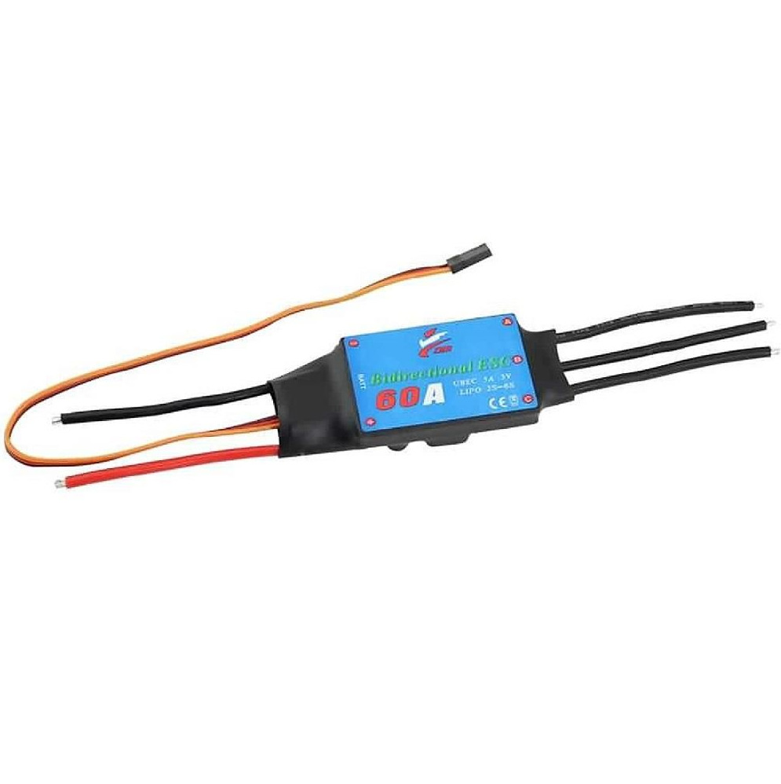

# Bidirectional ESC 60A

> Her iki thruster için ayrı birer ESC kullanılır. Diferansiyel hız kontrolü ile yönlendirme sağlanır, rudder gerekmez.



| | |
|-|-|
| Satıcı | robotzade.com |
| Birim Fiyat | 1.386 TL |
| Proje Adedi | 2 |
| Durum | Beklemede |

> **Not:** Orijinal listede f1depo.com 50A ESC stokta yoktu. Seçenek 1 önerilir.

---

## Teknik Özellikler

| Parametre | Değer |
|-----------|-------|
| Max sürekli akım | 60 A |
| Voltaj aralığı | 2S – 6S (7.4 V – 25.2 V) |
| Kontrol protokolü | PWM (1000–2000 µs) |
| Yön | Bidirectional (ileri + geri) |
| Motor tipi | Fırçasız (brushless), 3 faz |

---

## Alternatif Seçenekler

| Seçenek | Satıcı | Akım | Fiyat | Not |
|---------|--------|------|-------|-----|
| Bidirectional ESC 60A | robotzade.com | 60A | 1.386 TL | **Önerilen** |
| Bidirectional ESC 50A | motorobit.com | 50A | — | 6S uyumluluğu doğrula |
| VESC 6.7 70A (Flipsky) | — | 70A sürekli, 200A peak | ~3.000–5.000 TL | UART telemetri, gelişmiş; ileriye dönük seçenek |

---

## PWM Kontrol

| Pulse | Komut |
|-------|-------|
| 1000 µs | Tam geri |
| 1500 µs | Dur (nötr) |
| 2000 µs | Tam ileri |

ESP32 MCPWM ile üretilen sinyal: 50 Hz, 1000–2000 µs. Kod: `Firmware/src/esp32/src/motor.c`

---

## Bağlantı

```
Batarya (6S)
    → PDB
        → ESC Sol  ──PWM──  ESP32 GPIO17
             └── Motor Sol (3 faz: A-B-C)
        → ESC Sağ  ──PWM──  ESP32 GPIO18
             └── Motor Sağ (3 faz: A-B-C)
```

---

## Kalibrasyon (İlk Kullanım)

1. ESP32'den 1500 µs sinyal gönder (nötr)
2. ESC'ye güç ver
3. 3 saniye bekle — ESC bip sesi ile arm olur
4. Sinyal testi: yavaşça 1600 µs → motor ileri dönmeli

---

## Uyarılar

- **Kalibrasyon şart** — kalibrasyonsuz ESC davranışı tanımsız
- Ana hat kablosu **10 AWG** kullan
- Motor 3 faz kablosu yanlış sırada bağlanırsa motor titrer — iki kabloyu yer değiştir
- Uzun çalışmada ısınır — muhafaza dışına konumlandır veya soğutma ekle
