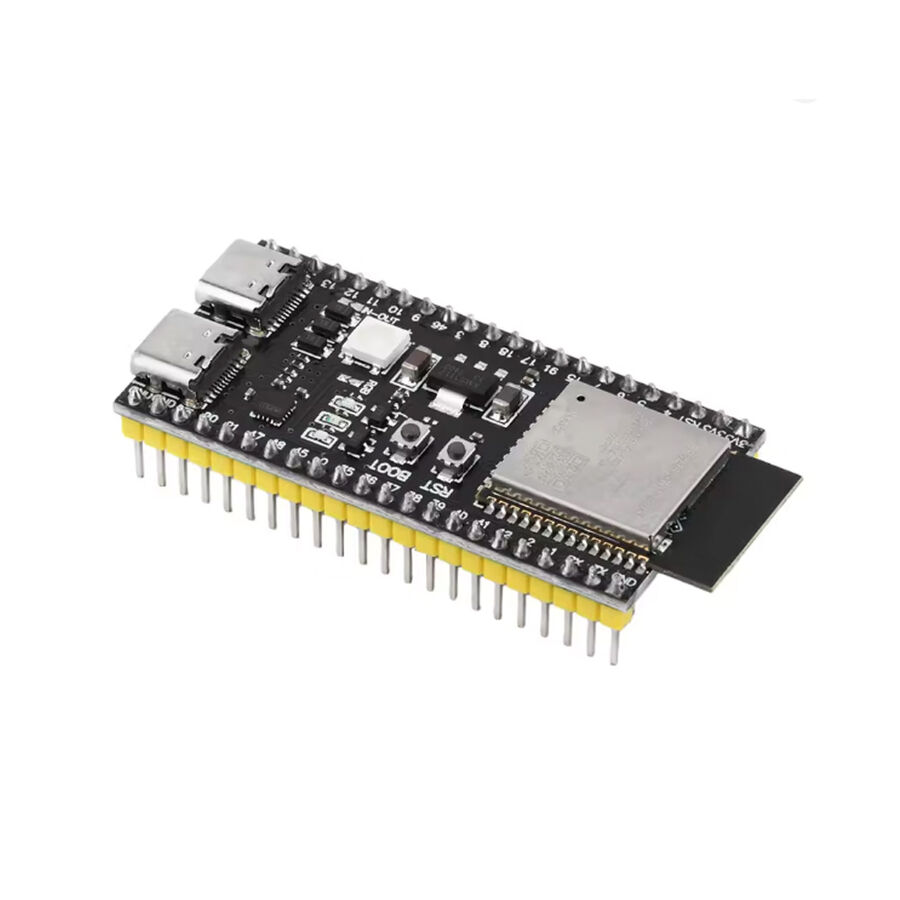

# ESP32-S3 N16R8

> Projenin ana mikrodenetleyicisi. iBUS RC alıcı, MCPWM ESC çıkışı, GPS ve IMU entegrasyonu bu kart üzerinden yürütülür.

| | |
|-|-|
| Üretici | Espressif Systems |
| Satıcı | direnc.net |
| Birim Fiyat | 539 TL (KDV dahil) |
| Proje Adedi | 1 |
| Durum | Alındı |

---

## Teknik Özellikler

### İşlemci

| Parametre | Değer |
|-----------|-------|
| CPU | Xtensa 32-bit LX7 dual-core |
| Frekans | 240 MHz |
| İç SRAM | 512 KB |
| ROM | 384 KB |

### Bellek

| Parametre | Değer |
|-----------|-------|
| Flash | 16 MB (Quad SPI, N16) |
| PSRAM | 8 MB (Octal SPI, R8) |

### Haberleşme

| Protokol | Detay |
|----------|-------|
| Wi-Fi | 2.4 GHz, 802.11 b/g/n |
| Bluetooth | 5.0 LE + Mesh |
| UART | 3× |
| SPI | 4× |
| I²C | 2× |
| I²S | 2× |
| USB | OTG + JTAG (dual Type-C) |

### GPIO & Analog

| Parametre | Değer |
|-----------|-------|
| GPIO | 45 programlanabilir pin |
| ADC | 2× 12-bit, 20 kanal |
| MCPWM | 2 grup, her grupta 3 timer |
| Touch | 14× kapasitif |

### Güvenlik

- AES-128/256, RSA, HMAC (donanım hızlandırmalı)
- Secure Boot, Flash Encryption

---

## Projede Kullanım

| Fonksiyon | Detay |
|-----------|-------|
| ESC PWM | MCPWM ile 50 Hz, 1000–2000 µs pulse |
| RC alıcı | iBUS → UART1 RX, 115200 baud |
| GPS | NMEA → UART2 (planlanan) |
| IMU | I²C (planlanan) |
| Telemetri | Wi-Fi veya UART üzerinden |

---

## Pin Atamaları

| Fonksiyon | Pin | Protokol | Durum |
|-----------|-----|----------|-------|
| ESC Sol | GPIO17 | MCPWM çıkış | Aktif |
| ESC Sağ | GPIO18 | MCPWM çıkış | Aktif |
| iBUS RX | GPIO16 | UART1 RX | Aktif |
| GPS TX | TBD | UART2 RX | Planlandı |
| IMU SDA | TBD | I²C | Planlandı |
| IMU SCL | TBD | I²C | Planlandı |
| Voltaj sensörü | TBD | ADC | Planlandı |

---

## Besleme

- **Giriş:** 3.3 V (Pololu S9V11F3S5C3 regülatörden)
- **Çalışma voltajı:** 3.3 V logic — 5V sinyal **bağlanamaz**, seviye kaydırıcı gerekli
- **Peak akım:** ~500 mA (Wi-Fi aktifken)

---

## Uyarılar

- 3.3 V logic seviyesi — 5 V sinyalleri doğrudan bağlama
- Su geçirmez muhafaza içine alınmalı
- GPIO26–37 arası flash/PSRAM tarafından kullanılır, atama yapma
- ADC2, Wi-Fi aktifken kullanılamaz — voltaj ölçümü için ADC1 pinlerini tercih et
