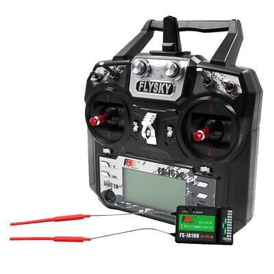

# FlySky FS-i6X + FS-iA6B

> 10 kanal 2.4 GHz RC sistemi. Kumanda FS-i6X, alıcı FS-iA6B. Projede iBUS protokolü ile tek hat üzerinden 14 kanal veri alınır.

| | |
|-|-|
| Kumanda | FS-i6X (10 kanal) |
| Alıcı | FS-iA6B (6 PWM + iBUS) |
| Protokol | iBUS (projede kullanılan) |
| Proje Adedi | 1 kumanda + 1 alıcı |
| Durum | Alındı |

---

## Teknik Özellikler

### Kumanda — FS-i6X

| Parametre | Değer |
|-----------|-------|
| Kanal | 10 (alıcıya göre 6 veya 10) |
| Frekans | 2.4 GHz AFHDS 2A |
| Çıkış protokolü | PPM, iBUS, S.Bus |
| Besleme | 4× AA pil |
| Telemetri | iBUS-sens (opsiyonel geri besleme) |

### Alıcı — FS-iA6B

| Parametre | Değer |
|-----------|-------|
| PWM çıkış | CH1–CH6 |
| iBUS çıkış | SENS soketinden, 14 kanal tek hat |
| Besleme | 4.0–6.5 V |
| Max akım | 100 mA |
| Sinyal voltajı | 3.3 V (ESP32 doğrudan bağlanır) |

---

## Kanal Ataması

| Kanal | İndeks | Fonksiyon | Kumanda Kontrolü |
|-------|--------|-----------|-----------------|
| CH1 | 0 | Yedek (Roll) | Sağ çubuk yatay |
| CH2 | 1 | Yedek (Pitch) | Sağ çubuk dikey |
| CH3 | 2 | **Gaz** | Sol çubuk dikey |
| CH4 | 3 | **Yaw (dönüş)** | Sol çubuk yatay |
| CH5 | 4 | **Arm switch** | SWA / SWD |
| CH6 | 5 | Yedek | VRA / SWC |

**Kod referansı:** `Firmware/src/esp32/src/control.c`
- `ibus_get_normalized(2)` → CH3 gaz (−1.0 … 1.0)
- `ibus_get_normalized(3)` → CH4 yaw (−1.0 … 1.0)

---

## iBUS Protokol Detayı

| Parametre | Değer |
|-----------|-------|
| Baud | 115200 |
| Frame uzunluğu | 32 bayt |
| Header | `0x20 0x40` |
| Checksum | `0xFFFF − sum(byte[0..29])` |
| Frame hızı | ~142 Hz (7 ms periyot) |
| Kanal değeri | 1000–2000 (1500 = merkez) |
| Bağlantı | Alıcı SENS soketi → ESP32 GPIO16 (UART1 RX) |

---

## Failsafe Yapılandırması

FS-iA6B sinyal kesilince frame göndermeyi durdurmaz — kanal değerlerini preset'e çeker. Firmware `ibus_is_failsafe()` ile 200 ms frame yokluğunu yakalar; ancak **alıcı failsafe değerleri mutlaka ayarlanmalıdır.**

**Adımlar:**
1. Kumanda → Menu → System → RX Setup → Failsafe
2. CH3 (Gaz) = **1500 µs** (nötr = dur)
3. CH4 (Yaw) = **1500 µs**
4. CH5 (Arm) = **1000 µs** (disarm)
5. Diğer kanallar = merkez
6. Kaydet ve test et: kumandayı kapat → ESP32 logda 200 ms içinde `FAILSAFE` görünmeli

---

## Bind (Eşleştirme) Prosedürü

1. Alıcının **B/VCC** portuna bind plug tak (2 pinli beyaz soket — SENS ile karıştırma)
2. Alıcıya güç ver — LED hızlı yanıp söner
3. Kumanda → Menu → System → RX Bind
4. Kumandayı aç — eşleşme otomatik tamamlanır
5. Bind plug'ı çıkar, alıcıyı yeniden başlat
6. LED sabit yanarsa bağlantı başarılı

---

## Uyarılar

- **Bind sonrası failsafe'i yeniden ayarla** — bind işlemi failsafe'i sıfırlar
- 2.4 GHz ortamda Wi-Fi / BT aktifse menzil azalabilir — saha testinde kontrol et
- Kumanda pili %30'un altındaysa paket kaybı olasılığı artar
- Anten dikey konumda maksimum menzil sağlar
