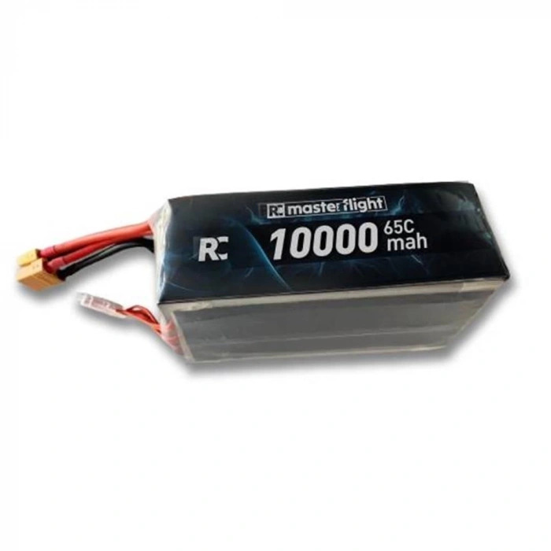

# Masterflight 6S 10000 mAh 65C LiPo

> Ana güç kaynağı. İki adet paralel bağlanarak 20 Ah kapasiteye ulaşılır. Toplam enerji: 444 Wh.

| | |
|-|-|
| Üretici | Masterflight |
| Hücre | 6S (seri) |
| Kapasite | 10.000 mAh / adet |
| Konnektör | XT90 |
| Proje Adedi | 2 (paralel) |
| Durum | Alındı |

---

## Teknik Özellikler

| Parametre | Değer |
|-----------|-------|
| Nominal voltaj | 22.2 V (3.70 V/hücre) |
| Tam dolu voltaj | 25.2 V (4.20 V/hücre) |
| Boş (cutoff) voltajı | 19.8 V (3.30 V/hücre) |
| Storage voltajı | 22.8–23.1 V (3.80–3.85 V/hücre) |
| C-rating (sürekli) | 65C → 650 A teorik |
| C-rating (anlık) | 130C → 1300 A teorik |
| Ağırlık | ~1400 g/adet |
| Konnektör | XT90 |
| Balance konnektör | JST-XH 7-pin (6S + GND) |

---

## Enerji ve Süre Tahmini

| Senaryo | Güç | Süre (444 Wh, %80 kullanım) |
|---------|-----|------------------------------|
| Tam gaz (2× thruster) | 1.554 W | ~14 dk |
| Cruise %60 | ~932 W | ~23 dk |
| Yavaş %30 | ~444 W | ~48 dk |
| Sadece elektronik | ~5 W | >50 saat |

> Süreler %100 → %20 deşarj baz alınarak hesaplandı (3.50 V/hücre cutoff).

---

## Paralel Bağlama

**XT90 paralel harness (2→1) ile bağlanır.**

1. Her iki bataryanın voltajı **eşit** olmalı (max 0.1 V fark)
2. Fark varsa önce balance şarj ile eşitle — direkt paralel bağlamak ark + akım şokuna yol açar
3. Paralel bağlandıktan sonra sistem tek büyük batarya gibi davranır
4. **Asla seri bağlama** — sistem 6S tasarımlı, seri bağlamak 12S yapar ve tüm elektroniği yakar

---

## Şarj Prosedürü

| Parametre | Değer |
|-----------|-------|
| Önerilen şarj akımı | 5 A (0.5C) |
| Maksimum şarj akımı | 10 A (1C) |
| Balance şarj | Zorunlu |
| Şarj sıcaklığı | 0–40 °C |
| Hedef voltaj | 4.20 V/hücre |
| Hücreler arası max fark | 50 mV (tam dolu sonrası) |

**Adımlar:**
1. Şarj cihazını **LiPo Balance** moduna al
2. Cell count: **6S** — otomatik algılama ile doğrula
3. Akım: 5 A (acil değilse)
4. Balance konnektörü bağla
5. **Gözetim altında** şarj et, asla yalnız bırakma
6. Bittikten sonra 10 dk bekle, hücre voltajlarını kontrol et

---

## Depolama

24 saatten uzun süre kullanılmayacaksa **storage voltajına** indir:

- Hedef: **3.80–3.85 V/hücre** (~22.8–23.1 V toplam)
- Şarj cihazında "Storage" veya "Discharge to storage" modunu kullan
- Tam dolu bırakılan LiPo → şişme + kalıcı kapasite kaybı
- Boş bırakılan LiPo → derin deşarj → geri dönüşü olmayan hasar

---

## Test Öncesi Kontrol Listesi

- [ ] Hücre voltajı > 4.10 V/hücre
- [ ] Hücreler arası fark < 50 mV
- [ ] Sıcaklık ortam sıcaklığında
- [ ] Şişme / balon yok (gözle ve elle kontrol)
- [ ] Kablo ve konnektörde hasar yok
- [ ] Test sonunda voltaj > 3.50 V/hücre kalmalı — düşükse durdur

---

## Güvenlik

### Yangın Riski

- LiPo yangını **su ile söndürülmez** — kum, toprak veya sınıf D söndürücü kullan
- Şarj sırasında **fireproof bag** zorunlu
- Yanıcı yüzey üzerinde şarj etme

### Şişmiş Batarya

Şişmiş batarya kullanılamaz. İmha prosedürü:

1. Tuzlu suya batır (3–4 yemek kaşığı tuz / 5 L su)
2. 1 hafta beklet — voltaj 0 V'a düşer
3. Belediye e-atık veya pil geri dönüşüm noktasına teslim et

### Taşıma

- Konnektörleri izole et (kısa devre riski)
- Sert plastik kutu içinde taşı
- Uçakla taşıma → havayolu LiPo kurallarına uy
