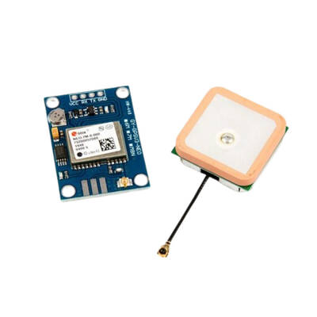

# u-blox NEO-7M GPS Modülü

> Pozisyon, hız ve zaman senkronizasyonu sağlar. NMEA protokolü üzerinden ESP32 UART2'ye bağlanır.



| | |
|-|-|
| Üretici | u-blox |
| Çip | NEO-7M |
| Arayüz | UART (NMEA veya UBX) |
| Proje Adedi | 1 |
| Durum | Alındı |

---

## Teknik Özellikler

| Parametre | Değer |
|-----------|-------|
| GNSS | GPS L1 C/A; GLONASS opsiyonel |
| Konum hassasiyeti (CEP) | 2.5 m (SBAS aktifken 2.0 m) |
| Update rate | 1–10 Hz (varsayılan 1 Hz) |
| TTFF (soğuk başlatma) | ~26 s |
| TTFF (sıcak başlatma) | ~1 s |
| Besleme | 3.3 V veya 5 V (modüldeki regülatöre bağlı) |
| Akım | ~50 mA (acquisition), ~30 mA (tracking) |
| Anten | Aktif seramik patch (modül üzerinde) |
| Varsayılan baud | 9600 |
| EEPROM | Var — konfigürasyon kalıcı |
| Yedek pil | CR1220 (sıcak başlatma için) |

---

## Projede Kullanım

| Fonksiyon | Detay |
|-----------|-------|
| Konum | Enlem / boylam → waypoint takibi |
| Hız | SOG (sürat üzerinde hız) |
| Heading | COG (hareket yönü, > 0.5 m/s güvenilir) |
| Zaman | UTC senkronizasyonu |

> NEO-7M dahili pusula içermez. Heading yalnızca hareket sırasında geçerlidir.

---

## Bağlantı

| GPS Pin | ESP32-S3 | Not |
|---------|----------|-----|
| VCC | 3.3 V veya 5 V | Modüldeki regülatöre göre |
| GND | GND | Ortak |
| TX | GPIO (UART2 RX) — TBD | NMEA çıkışı |
| RX | GPIO (UART2 TX) — TBD | u-center konfigürasyonu için (opsiyonel) |

---

## NMEA Çıktıları

| Cümle | İçerik |
|-------|--------|
| `$GPRMC` | Konum, hız, heading, tarih, zaman — **en faydalı** |
| `$GPGGA` | Konum, irtifa, uydu sayısı, fix kalitesi |
| `$GPGSA` | DOP değerleri, fix modu |
| `$GPGSV` | Uydu detayları |
| `$GPVTG` | Hız ve heading |

Önerilen minimal konfigürasyon: yalnızca **GGA + RMC** aktif, diğerleri kapalı.

---

## u-center ile Konfigürasyon

İlk kullanımda bir kez yapılandır (Windows / USB-UART adaptör):

1. u-center aç, port ve baud (9600) seç
2. View → Configuration View:
   - **NMEA:** yalnızca GGA + RMC aktif
   - **Rate:** 200 ms → 5 Hz
   - **PRT:** baud → 115200
   - **SBAS:** EGNOS aktif (Avrupa / Türkiye, +0.5 m hassasiyet)
   - **CFG:** Save → EEPROM'a yaz

Konfigürasyon EEPROM'a yazıldıktan sonra güç kesilse de korunur.

---

## Kod İskeleti (Planlanan)

```c
#include "driver/uart.h"

#define GPS_UART    UART_NUM_2
#define GPS_RX_PIN  GPIO_NUM_XX  /* TBD */
#define GPS_TX_PIN  GPIO_NUM_XX  /* TBD */

uart_config_t cfg = {
    .baud_rate = 115200,
    .data_bits = UART_DATA_8_BITS,
    .parity    = UART_PARITY_DISABLE,
    .stop_bits = UART_STOP_BITS_1,
};
uart_param_config(GPS_UART, &cfg);
uart_set_pin(GPS_UART, GPS_TX_PIN, GPS_RX_PIN, -1, -1);
uart_driver_install(GPS_UART, 512, 0, 0, NULL, 0);

/* NMEA parse için minmea kütüphanesi önerilir */
```

---

## Anten Yerleşimi

- Gökyüzü görüşü açık olmalı — şeffaf panel veya muhafaza dışı
- Metal yüzeylerden en az 5 cm uzak
- ESP32, ESC ve motor gürültüsünden > 20 cm uzak
- Patch antenin üst yüzü gökyüzüne bakmalı (yatay montaj)

---

## Beklenen Saha Performansı

| Ortam | Uydu | HDOP | Hassasiyet |
|-------|------|------|------------|
| Açık alan / deniz | 8–12 | 0.8–1.5 | ±2 m |
| Şehir / engelli | 4–8 | 2–5 | ±5–10 m |

> HDOP > 3 ise waypoint takibi yapma.

---

## Uyarılar

- Soğuk başlatmada açık alanda 2–5 dk bekle (ilk fix)
- CR1220 backup pili bittiyse her seferinde cold start yaşanır — pili değiştir
- NEO-8M / NEO-9M daha yeni alternatif: GLONASS + Galileo desteği, daha hızlı fix
- 5 V besleme gerekiyorsa modüldeki regülatör 3.3 V'a düşürür — datasheet kontrol et

---

## Açık Sorular

- [ ] Modül üzerindeki regülatör 3.3 V mi 5 V mu bekliyor?
- [ ] UART2 pin ataması (GPS_RX / GPS_TX) netleştirilecek
